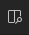

# Getting started

* Download and install [VSCode](https://code.visualstudio.com/) and [Docker](https://www.docker.com/products/docker-desktop/)
* Install the [Remote-Container extension](https://marketplace.visualstudio.com/items?itemName=ms-vscode-remote.remote-containers), the [Open Folder Context Menus extension](https://marketplace.visualstudio.com/items?itemName=chrisdias.vscode-opennewinstance#:~:text=Right%20click%20on%20a%20folder,Here%20or%20Reopen%20Workbench%20Here.) and the [Marp extension](https://marketplace.visualstudio.com/items?itemName=marp-team.marp-vscode) in VSCode.

# Usage

* Download this repo and open the presentation folder in VSCode. Select the 'Reopen in Container option'.
* You can build the presentation with `Ctrl/Cmd+Shift+P -> Latex Workshop: Build LaTeX project`. You can view the pdf by clicking on the  icon on the upper right.

# Templates

* [UGent beamer](https://github.com/GQCG-oss/ugent-beamer)
* [GQCG Cleanthesis](https://github.com/GQCG-oss/cleanthesis)

# Documentation and Support

* You can learn the [basics of LaTeX](https://www.overleaf.com/learn/latex/Creating_a_document_in_LaTeX) on Overleaf.
* [Learn Git and Github](https://www.youtube.com/watch?v=RGOj5yH7evk) for collaboration and project management.

# FAQ

- [Markdown > Marp: Enable HTML](https://github.com/orgs/marp-team/discussions/192)

