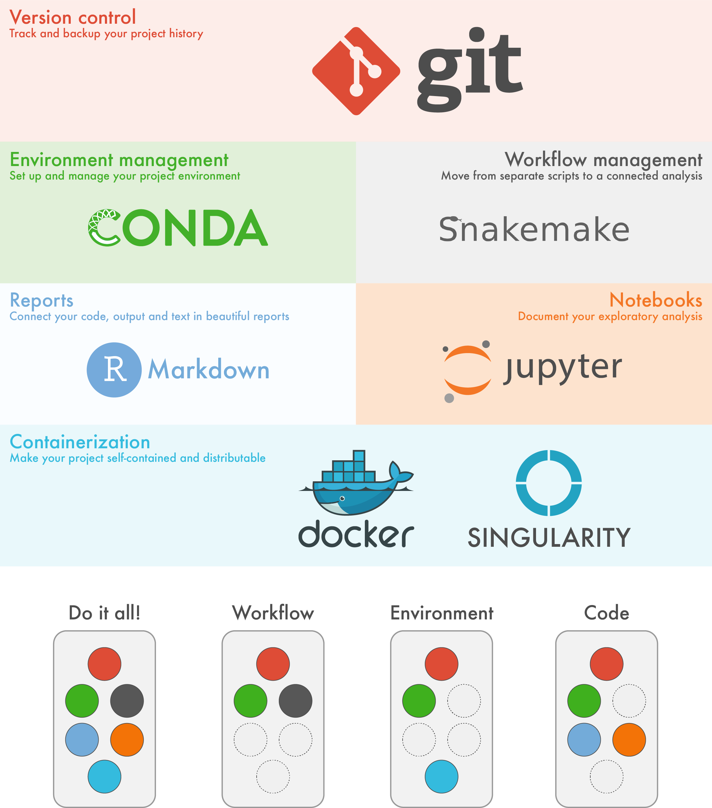

# **LaTeX**
## a cog in reproducible research

---

# Why (not) LaTeX

## Pro

* **flat text**
* Stability needed for large documents
* You don't have to control formatting

## Con

* Only as strong as the weakest member of your research community
* It is very hard to control formatting

Remedy: Only use LaTeX when absolutely needed!

---

# Why?

The (long) road to reproducible research.

 

---

# How?

---

# What?

---

