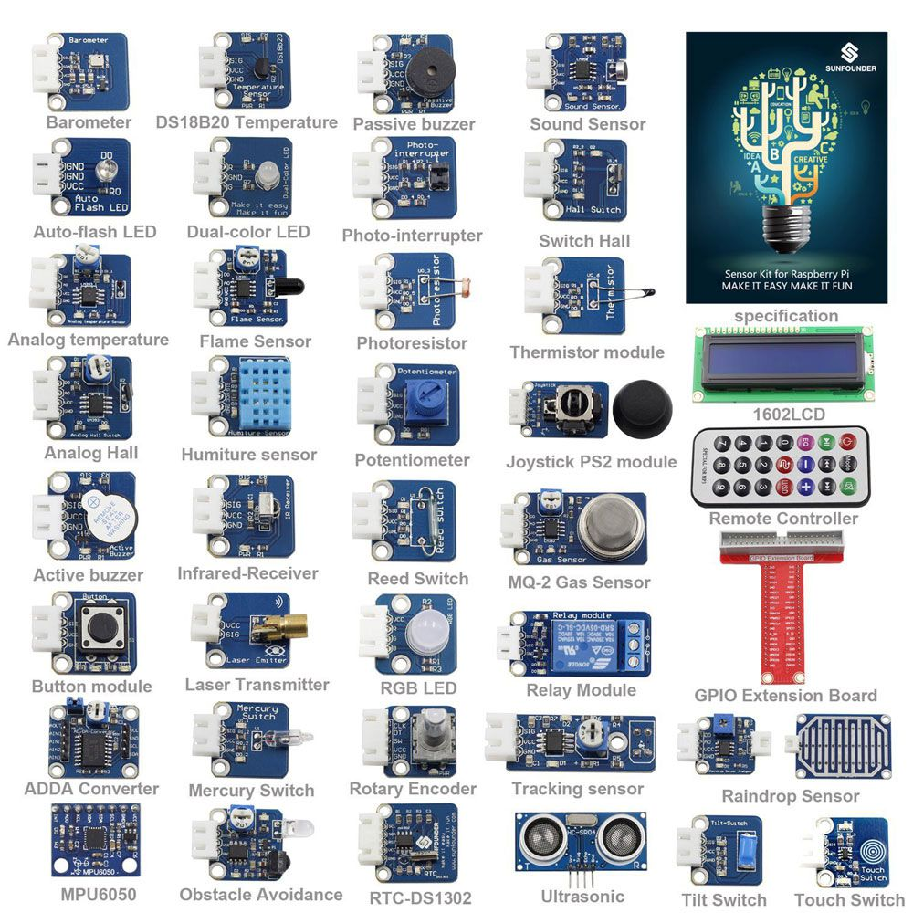
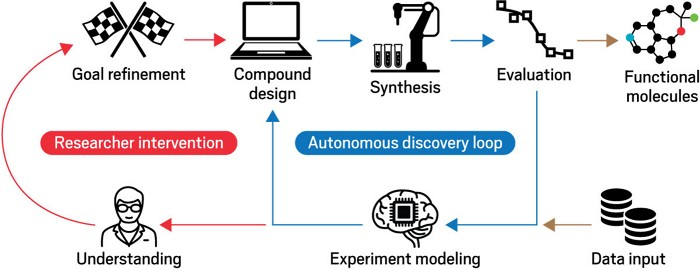

# **LaTeX**
## a cog in a reproducible research framework

---

# Why (not) LaTeX

## Pro

* **Flat text**
* Stability needed for large documents
* You don't have to control formatting

## Con

* Only as strong as the weakest member of your research community
* It is very hard to control formatting
* You need to get used to an ecosystem of different tools

Remedy: Only use LaTeX when absolutely needed!

---

# Tutorial 1: the UGent beamer template

- Download [UGent beamer](https://github.com/GQCG-oss/ugent-beamer) template.
- Reopen the root folder in a container.
- Cmd/Ctrl+Shift+P > LaTeX Workshop: Build LaTeX project.

---

# What did we just do?

We have started our journey on the (long) road to reproducible research.

We are now at the *environment* stage:
* Docker
* Git
* Conda

Made possible by user-friendly interfaces: 

* VSCode (.devcontainer)
* Github (intro to issues and PRs)

 

---

# Use case: spin diagrams

Want to **fully** reproduce one of our latest papers? Download our [spin-diagrams repo](https://github.com/GQCG-res/spin-diagrams) and 
* open the `notebooks` to reproduce/extend our results
* open the `paper` folders to adjust our papers

Meet the cloud: [Github Codespaces](https://github.com/features/codespaces).

---

# Tutorial 2: thesis template

- Download the [GQCG Cleanthesis](https://github.com/GQCG-oss/cleanthesis) template.
- Reopen the root folder in a container.
- Cmd/Ctrl+Shift+P > LaTeX Workshop: Build LaTeX project.

---

# Use case: Bookdown and Knowdes

Standard LaTeX classes are **not** always the way to go. 

We want to have access to the Wikipedia of Electronic Structure Theory.

Meet [Knowdes](https://gqcg-res.github.io/knowdes/), powered by [Bookdown](https://bookdown.org/).

---

# Some questions

- These slides were made with [Marp](https://marp.app/), which support math TeX code (e.g. $\hat{H} \ket{\Psi} = E \ket{\Psi}$). I did **not** use beamer. Why? 
- LaTeX vs Word should be viewed in a wider context: what are the most important documents for *you* and *your group*? Do they need to be kept **agile**?
- *As intended by Microsoft*, leaving the Office Ecosystem is hard. Why? 
- Note that **one** click that is not *captured* can break reproducibility! Why is this a bad thing?

---

# Closing remarks: the future is now

 

<G|QC|G>'s IoT, data analysis and machine learning solutions are only a devcontainer away!
